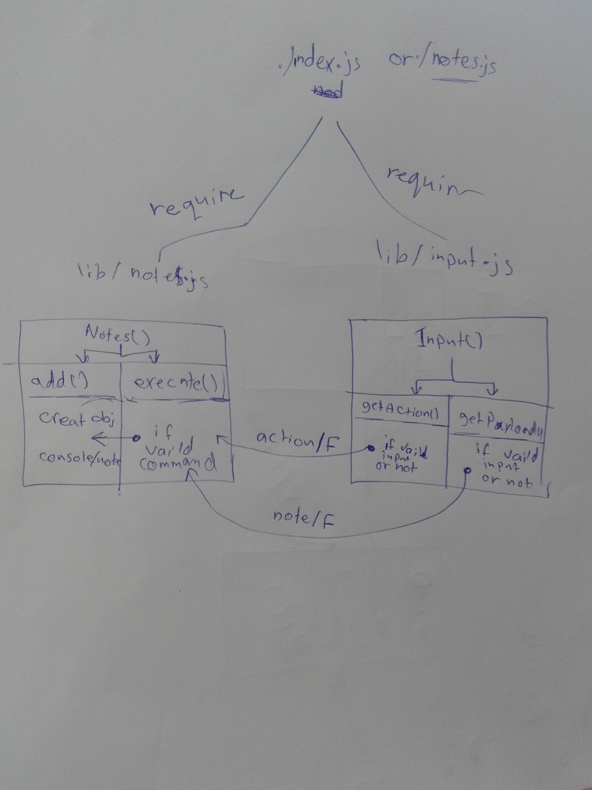

## LAB - Class 02

### Project: Notesy

### Author: Batool Al-Ali

### Links and Resources

### Submission PR
- [submission PR](https://github.com/batool-alali-401-advanced-javascript/notes/pull/3)
- [ci/cd](https://github.com/batool-alali-401-advanced-javascript/notes/runs/686940178) (GitHub Actions)

### Setup
- No setup requirements

### How to initialize/run your application (where applicable)
 - `$ npm init -y`.
 - `$ node notes.js [-a || --add] '<any note>'`.  P.S (the note must be within quotes)

### How to use your library 
- minimist => `$ npm i minimist`

#### Tests

- `npm run lint`
- `npm test`

### UML
