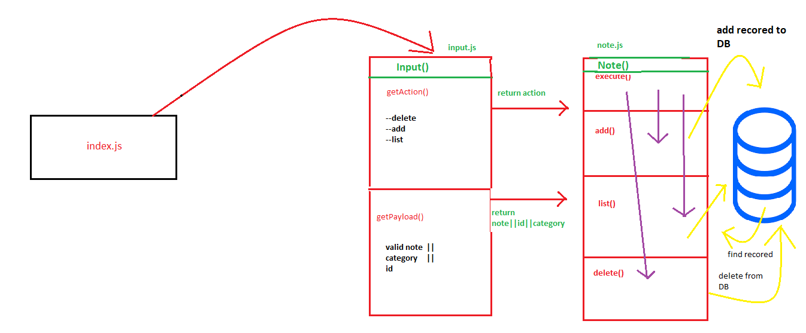

## LAB - Class 04

### Project: Notesy

### Author: Batool Al-Ali

### Links and Resources

### Submission PR
- [submission PR](https://github.com/batool-alali-401-advanced-javascript/notes/pull/10)
- [CI/Action](https://github.com/batool-alali-401-advanced-javascript/notes/runs/715194297)

### Setup
.env (MONGODB_URI)
### How to initialize/run your application (where applicable)
 - `$ npm init -y`.
 - `$ node index.js [-a || --add] '<any note>'  --category <'any category'>`.  P.S (the note must be within quotes)
 - `$ node index.js --list <'category'>`
 - `$ node index.js --delete <'id'>`

### tests
- lint test
- jest test 

### How to use your library 
- minimist => `$ npm i minimist`
- dotenv =>   `$ npm i dotenv`
- mongoose =>  `$ npm i mongoose`

### UML
